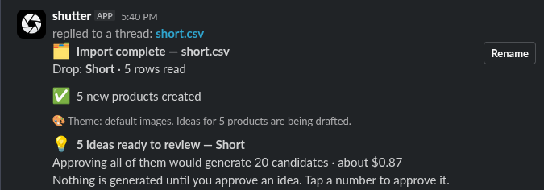
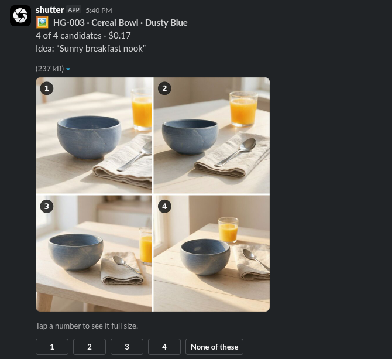
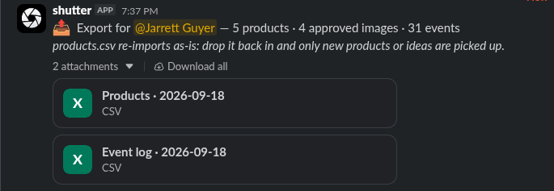

# Approach

## Try it

A Slack bot belongs to the one workspace it is installed in, and sharing it across organisations
needs per-workspace OAuth and tenancy that are out of scope here. The quickest way in is to run it
locally: create the app from [`slack/manifest.yaml`](slack/manifest.yaml) in your own workspace
and follow **[INSTALL.md](INSTALL.md)**, Path A (~15 minutes, Docker only).

## What I built, and why

Reading the brief, I took this team's real problems to be four: **a new tool to install**, **work
scattered across too many places** (sheet, Slack, inbox, Drive), **the time it takes**, and **the
product page drifting out of step with what was approved** (the wrong `IMG_43xx.jpg`, live for
three weeks).

So I built **Shutter**, a Slack bot that lives where the team already plans and discusses images,
plus a small backend the product site hooks into once:

| Their problem                   | What Shutter does                                                                                                                                              |
| ------------------------------- | -------------------------------------------------------------------------------------------------------------------------------------------------------------- |
| A new tool to install           | Nothing to install or log into. Invite the bot to a channel, answer two questions, done                                                                        |
| Too many places                 | One review channel holds the whole life of a request: CSV in, ideas, candidates, approvals, status                                                             |
| Time                            | AI drafts shot ideas, Luma generates candidates in about a minute, and every step is one tap on a phone                                                        |
| Page out of step with approvals | **Approving an image publishes it.** The site asks a per-SKU lookup for its images, so a change is live in seconds, at an immutable URL, with a one-tap revert |

I kept commands to a minimum. Getting from a CSV to approved, published images needs no command
at all: drop the file in the channel and follow the buttons in the messages. The `/shots` commands
are for looking things up (status, a product, an export), not for doing the work. Along the way
everything is recorded (who approved what, when, and what it cost), and the people who care are
kept informed without having to ask: a drop reports its own progress daily, and nudges surface
anything stuck.

**What it looks like.** A CSV dropped in the channel becomes a named drop, and nothing costs money
until an idea is approved:

Approving an idea generates four candidates about a minute later, as a numbered contact sheet. Tap
a number to see it full size beside the original photo, then approve it, which publishes it:

`/shots export` hands back the sheet with status and image links added, plus the full event log.
The product file re-imports as-is:

**Maya's asks, answered:**

| She asked                                                 | Answered by                                                                                        |
| --------------------------------------------------------- | -------------------------------------------------------------------------------------------------- |
| "Can the AI just make the shots people put in the sheet?" | Sheet ideas import and are expanded into concrete options; products with no idea get three drafted |
| "Ellie approves them on her phone somehow"                | One-tap approval in Slack, with each candidate shown full size beside the original photo           |
| "Don't burn our budget on stuff she'll reject"            | Nothing is generated until an idea is approved, and every button that spends money shows its cost  |
| "See where things stand without having to ask Ellie"      | `/shots status` at three zoom levels, and the drop posting its own progress                        |
| "A 40-product drop… launch with styled shots"             | Drop the CSV in the channel; it becomes a named drop, tracked to done                              |

## Key decisions and tradeoffs

My rule was to stay as close as possible to how this team already works, and to respect every
failure they had already named. I wrote [ASSUMPTIONS.md](ASSUMPTIONS.md) first, then
[REQUIREMENTS.md](REQUIREMENTS.md), then walked every flow message by message in
[USER_FLOWS.md](USER_FLOWS.md). By the time I reached the build, few decisions were left open,
because the team's weak points were so plain in the brief.

**The biggest one: no web front end.** Everything happens in Slack, where the team already is. The
case for the alternative, and why it lost, is the next section.

Every other decision, with what it costs and the signal that would mean it was wrong, is in
[ASSUMPTIONS.md](ASSUMPTIONS.md) (the team-facing calls, numbered #1–#16) and
[REQUIREMENTS.md](REQUIREMENTS.md) (each step of their process, the options considered, and the
stack).

## The road not taken

**The strongest alternative was a web application:** a site the team logs into, with full control
over every product, image and record. At its best it is a better tool than a bot: a grid of the
whole catalogue, bulk actions, real side-by-side comparison, filters, and a browsable history of
every approval and every dollar spent. Slack's message format cannot match any of that.

**It lost because of who it is for.** It pulls the team out of the tool they already talk in, and
it is one more app whose process they have to learn. Ellie said plainly that she won't install
anything new, and the team has already abandoned one tool that asked them to go somewhere new to
work: it had a beautiful dashboard, and nobody logged in after week one. A more capable tool that
nobody opens does less than a simpler one that meets them where they are.

**What choosing Slack cost:** review is shaped by what a Slack message can show, and the history
has no screen of its own, only a CSV export.

**It could still earn a place later.** Right now this team would see a web portal as bloat nobody
asked for. But a _read-only_ view, somewhere to look something up when something has gone wrong,
is a different thing from a place to _do the work_. The signal to build it is a question the CSV
export cannot answer without a spreadsheet session, such as repeated "who approved this, and why?"
([REQUIREMENTS](REQUIREMENTS.md#part-4--out-of-scope--future), _Web-based data view_).

## Scope ledger

What is built is the whole path from a CSV to images live on the product page, so the team can
solve its problem on day one. Everything left out would make the bot more robust and more
adaptable, but none of it is needed to get a drop shot, approved and published. Full reasoning
for every item is in [REQUIREMENTS.md](REQUIREMENTS.md), Parts 4 and 5.

**How it was cut.** I priced the day before building. The core path alone filled it, so the
question was never what to add but what to leave out, and I cut by value, deciding in advance what
would go first if the day ran behind (themes). The day ran long instead, and two flows planned as
_next_ came back in.

**In**

- **The core path:** setup (invite the bot, name the approver, describe the house style) · CSV
  import by dropping the file in the channel · idea review · generation and candidate review,
  including force-approve · the per-SKU lookup the site calls · `/shots status` · CSV export ·
  an event log of every decision
- **Two deliberate additions:** nudges and a daily progress post for each drop (without them, a
  product with one of its two images approved waits on nobody and sits in no queue), and campaign
  themes end to end (Maya names the Q4 campaign)
- **Built after the plan:** replacing a product's source photo, and photographer uploads (the
  import already flagged products needing a new photo, and nothing could clear the flag) · setting
  priority · `/shots endpoints` for the web developer · reset scripts and demo commands

**Next** (designed in full, left out for time, each with the signal to build it)

| Item                                                | Build it when                                                                                                                                             |
| --------------------------------------------------- | --------------------------------------------------------------------------------------------------------------------------------------------------------- |
| Reviewing changes to existing products on re-import | Someone edits an existing row in the sheet and re-exports. Until then the import summary says out loud that changes to existing products were not applied |
| `[Make primary]`, to reorder a product's images     | Anyone asks which image the product page leads with                                                                                                       |
| Grouping several products into one shot             | Someone asks for a styled set                                                                                                                             |
| `/shots approvers`, and moving the review channel   | The approver is away, or the bot is invited to a second channel                                                                                           |
| Archiving products                                  | The queue carries products nobody intends to shoot                                                                                                        |
| Budget warnings and spend comparisons over time     | Spend surprises someone, or a second drop completes                                                                                                       |

**Out** (not needed by this team now; the full list is in REQUIREMENTS Part 4)

| Item                                       | Build it when                                                               |
| ------------------------------------------ | --------------------------------------------------------------------------- |
| Other aspect ratios for social             | Someone crops an approved image by hand                                     |
| Automated quality checks before review     | Rounds keep getting rejected wholesale                                      |
| An email digest                            | Items keep being force-approved, meaning Slack is not reaching the approver |
| A read-only web view                       | A question the export can't answer (see _The road not taken_)               |
| A storefront connector, and image resizing | The team names its platform, or page weight becomes a complaint             |
| A faster Luma plan                         | Approvers finish idea review and are left waiting on images                 |
| Serving other workspaces                   | A second customer commits                                                   |
| Google Drive                               | Cut outright. The lookup and the export do its job                          |

## Unit economics

**Under 20 cents per approved image, at worst.** One generated image costs $0.043, and a round of
four costs $0.17. In the worst case only one of the four is approved, so that one image carries the
cost of the whole round: about $0.18. Drafting the shot ideas adds well under a cent per product.
Every extra approval from the same round brings the price down.

**About a minute per round of four**, and a few seconds to draft ideas. Her time is the taps.

**The whole 40-product drop costs about $7**, if every product gets one round of four. It stays
under $10 even if a quarter of them need a second round. Even before counting the weeks saved,
that is incomparable to hiring and managing a freelance photographer.

**At 10× the catalogue**, the cost scales in a straight line and stays small. What changes is
time: Luma runs at most ten images at once, about nine a minute, so a 40-product drop takes around
18 minutes and a full 3,000-product pass would take about a day. The fix is a higher Luma tier,
which is a single setting (`LUMA_MAX_CONCURRENT`), and the bigger constraint becomes how many ideas
and images one approver can review.

## What breaks first under pressure

In the order I expect them to bite:

1. **Luma's limit of ten images at once.** This is the first wall, and it was found in the build,
   not guessed. A burst of approvals exceeded it and whole rounds failed, so images now wait in the
   database and go out as slots free up, oldest approval first. Nothing fails any more, but a big
   approval session gets slower: about 18 minutes for a full 40-product drop. The fix is a higher
   Luma tier and one setting.
2. **The single worker.** One background process does all the waiting on Luma, the daily post and
   the nudges, and it must stay single: a second copy would miscount Luma's free slots and post
   everything twice. Only a number in `compose.yaml` enforces that. The fix is pg-boss, a job queue
   on the database that already exists, which lets several workers share the work safely.
3. **One disk on one box.** The demo's database and every image live on one volume on one VM, so
   losing the VM loses the demo. That is accepted for a demo, and the production stack's RDS and S3
   answer it with a configuration change.
4. **Updates nobody is told about.** Each product is one Slack message that changes in place as it
   moves from idea to candidates to approved, and Slack doesn't notify anyone when a message is
   edited. So when candidates arrive, nobody gets a ping. **In practice this is a small problem:**
   the Shutter channel becomes the team's single point of focus during a drop, and it visually
   tracks completion. Cards turn from ideas into contact sheets into approved lines as you watch,
   and anything left waiting shows up in the stuck list, the nudges and the daily post. If
   candidates start going stale while the approver is active in the channel, the fix is a thread
   reply on the card, which notifies without adding clutter.
5. **Slack's posting limits.** A drop posts a card per product, and Slack throttles apps that post
   too quickly. Cards are already posted a few at a time, which is comfortable at 40 products. At
   the full 300-product catalogue it is worth watching, and a separate ideas channel is a
   configuration change, not a redesign.

## How I used the AI

I spent about 90% of the time on the thinking: [ASSUMPTIONS.md](ASSUMPTIONS.md), then
[REQUIREMENTS.md](REQUIREMENTS.md), then [USER_FLOWS.md](USER_FLOWS.md). The AI brought
recommendations, one question at a time with one or two options each, and I made every call. Many
of the best decisions came from reframing the question rather than picking an option.

Once coding began, it was a matter of following those docs. When the build taught us something, it
went back into them rather than around them. Those three documents remained live as sources of truth, to adjust when a test hit a wall or after viewing generation results, for example.
