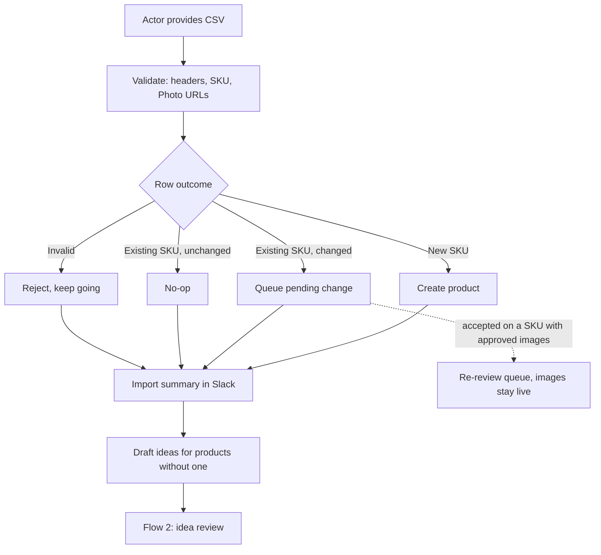

# User Flows

> Companion to [REQUIREMENTS.md](REQUIREMENTS.md) and [ASSUMPTIONS.md](ASSUMPTIONS.md).
> Requirements say *what* the system does and why. This document walks a person
> through it message by message, so gaps show up before the build rather than during it.
>
> Status: **Flows 0–3 complete** — every decision they raised is settled. Flows 4–7 not started.
> Items marked **[OPEN]** carry options only; nothing is decided until a **Decision** line is filled in.

## Conventions

- **Actor** is the person acting; **System** is what the app does in response.
- Slack messages are shown as mockups, because they *are* the UI: per ASSUMPTIONS #2
  there is no web app to log into and no email approval path.
- `[Button]` is a Slack action button. Everything must work one-handed on a phone.
- Each flow states its **trigger**, **preconditions**, **exit state**, and the flow it hands off to.
- References like (#12) point at the numbered entries in ASSUMPTIONS.md.

## Flow index

| # | Flow | Primary actor | Status |
|---|---|---|---|
| 0 | Install and set up the bot in a channel | Whoever installs | **Settled** |
| 1 | Import a new CSV export | Ellie or Maya | **Settled** |
| 2 | Idea review (batch) | An approver | **Settled** |
| 3 | Generation, candidate review, approval | An approver | **Settled** |
| 4 | Status check | Maya | Not started |
| 5 | Photographer upload | Freelancer | Not started |
| 6 | Replace a source photo | Anyone | Not started |
| 7 | Consuming approved images | Web person, and anyone doing marketing | Not started |

---

# Flow 0 — Install and set up the bot in a channel

**Goal:** get from "someone added a Slack app" to "the team can drop a CSV" in as few taps
as one person can manage alone, without a settings screen.

**Trigger:** someone invites the bot to a Slack channel.

**Preconditions:** the app is deployed and publicly reachable, and a workspace admin has
approved the install if the workspace requires approval.

**Exit state:** one review channel is set, at least one **approver** is named, a house style
blurb exists (or was explicitly skipped), every other setting is on a documented default,
and the channel has been told what to do next.

**Hands off to:** Flow 1 (import a CSV export).

> **Terminology.** The person who "normally has final say and doesn't need to force-approve"
> is called the **approver** here, matching ASSUMPTIONS #1. It is a *role*, not a person —
> usually Ellie at this company, usually one person anywhere, but the role can be held by
> more than one.

## Main path

### Step 1 — Install, then invite

Two separate acts, and only the second one matters to this flow:

- **Install to the workspace** — OAuth, once, possibly done by an admin who is not on this team.
- **Invite to a channel** — `/invite @shots` in the channel the team wants reviews in.

**The invite is the configuration.** Whichever channel the bot is invited to becomes the
review channel (#2a). There is no separate "choose a channel" step and no channel picker to
get wrong, which also means the person who sets this up never has to know the phrase
"review channel" before they see it working.

An install with nobody inviting the bot anywhere is **not** a set-up install — it has no
channel, no approver, and nowhere to post. See Branches.

### Step 2 — Name the approver

**System:** posts its first message in the channel, with the approver already filled in.

```
👋  Thanks for the invite — I'll post shot reviews in this channel.

     Approver:  @ellie   (you invited me, so I assumed it's you)

     The approver decides. For them it's one tap. Anyone else can still
     approve when they're away, but it's a deliberate "force approve"
     and it's recorded with their name.

     [That's right]      [It's someone else…]
```

**Decision: the inviter is the approver by default, and can hand the role to someone else
right here.** Whoever is setting this up is usually the person who runs it, so the default
is right most of the time and costs one tap to confirm. When it is wrong — an engineer or
an admin did the install — `[It's someone else…]` opens a user picker and hands the role over.

The rules the role carries:

| Rule | Why |
|---|---|
| Setup names **exactly one** approver | Keeps first-run to a single tap. A second approver is rare and takes two taps later (Step 5). |
| The set is **never empty** | With no approver, *every* approval is a force-approve, which quietly voids the distinction #1 is built on. Removing the last one is refused. |
| Only an approver can change the set | Otherwise anyone can make themselves approver, and force-approve friction becomes decoration. |
| Escape hatch: a **workspace admin** can change it if no approver is reachable | Covers the one way the rule above can deadlock — see Branches. |
| Every change is **announced in the channel and recorded** | Who can decide is at least as consequential as a single decision, and #1 already commits to an honest audit trail. |
| Pending work is **never reassigned** | Items wait on *an approver*, not on a person. Changing the role mid-drop moves nothing and loses nothing. |
| An approver must be a **member of this channel** | They cannot act on a message they cannot see. Naming a non-member offers to invite them. |

*(Deliberately not offered at setup: adding a second approver. Setup stays one tap, and a
team that wants two can add the second in Step 5 once they have seen the thing work.)*

### Step 3 — Describe the house style

**System:** asks, in the same channel, for the one other thing it cannot guess.

```
🎨  Last thing — how should styled shots look?

     A line or two about your brand's look. It steers every shot idea
     I draft, so it's worth the minute. `/shots style` changes it later.

     For example: "warm, lived-in, natural light, no people, minimal
     props, a little mess."

     [Describe your look…]        [Skip for now]
```

**Decision (0.1): the team is asked for the house style at setup, in their own words.**
The blurb steers every idea the system will ever draft, and there is no safe default for
"what does this brand look like" — a generic home-goods blurb would be confidently wrong
and invisible, since nobody reads a setting they did not write.

- `[Describe your look…]` opens a plain-text box. Plain text, because #3b keeps both style
  layers as text the team owns.
- The example is shown as **guidance, not a prefilled value**. The team writes their own.
- `[Skip for now]` exists so install never blocks. Ideas then draft from product data alone,
  and the first import says so once.

**Mitigation for the known weakness.** ASSUMPTIONS #3b argues against exactly this — a box
asked for cold is the wizard screen nobody fills in, and an answer derived from the team's
16 real shot ideas would be better than one written from scratch. That argument does not
disappear because the question moved; it just stops being install's problem. So once a
catalog exists, `/shots style` offers **"suggest one from your existing shot ideas"**, which
is #3b's seeding preserved as an opt-in action rather than an install-time dependency. A
team that skipped, or wrote something thin, gets the derived version whenever they want it.

> **Contradicts ASSUMPTIONS #3b**, which says install shows a *seeded* blurb "rather than
> asked for cold." #3b is not satisfiable as written — its seed data arrives by CSV, after
> install. Flagged in REQUIREMENTS § A; #3b itself should be amended, not just annotated.

*(Rejected: seeding from the first import. It produces the better blurb and keeps setup to
one question, but it makes the first import structurally different from every later one,
and it leaves the very first batch of ideas drafted against nothing.)*

### Step 4 — Everything else takes a default

**System:** does not ask about any of this. Each value is a documented default, visible and
changeable from Slack later.

| Setting | Default | Source |
|---|---|---|
| Candidates per round | 4 | #13 |
| Max rounds per product | 3 | #13 |
| Model | `uni-1`, selectable per product or idea | #14 |
| Budget warning thresholds | off | #13 — optional by design, and a number nobody has yet |
| Scheduled status reports | off | #5 — opt-in |
| Campaign theme | none | #3b — set per import (Flow 1, Step 4) |

The reasoning is the brief's own evidence: this team abandoned a tool nobody logged into.
A setup wizard is that tool's first screen. So the rule is that **setup asks only the
questions with no safe default**, and there are exactly two: *who decides* (Step 2) and
*what does this brand look like* (Step 3). Everything in the table above has a defensible
default, so none of it is asked.

### Step 5 — Tell the web person where the images are

**Decision (0.3): Google Drive is dropped from scope, and setup posts the lookup base URL
in the channel.**

**Drive is cut.** ASSUMPTIONS #4 settled on "A + B + C, all three" — approved images copied
to Drive *and* served from our storage. Storage was already canonical; Drive was only a
human-readable copy. Cutting it removes a Google service account, an OAuth path, folder
configuration, and an entire class of failure where the copy and the canonical store
disagree — none of which was buying anything the storage layer did not already do.

What the team loses, and what covers it today:

| Lost with Drive | Covered by |
|---|---|
| A browsable folder for social and the Q4 campaign | The approval message in Slack still holds the image; the review channel is a searchable archive of everything approved. |
| Grabbing many images at once | The updated CSV export with image-link columns (REQUIREMENTS Part 3), which is now load-bearing rather than a nice-to-have. |
| A place to point a non-technical person at | **Next, not now:** ask the bot for them — see below. |

**The lookup URL is posted, not passed around.** With Drive gone, the per-SKU lookup is the
only path to approved images, so the web person must not have to ask anyone for it — that
is the exact pain the brief describes ("has to ask in Slack which files are final"). Storage
itself stays deploy-time operator config; only the resulting base URL is surfaced.

```
🔌  For whoever wires up the site:

     GET https://<host>/products/{SKU}/images

     Returns approved images in display order, primary first, each with an
     immutable URL and its origin (ai / photographer). Approving an image
     changes what this returns — no upload step, no dev work per product.
```

**Next, not now — request approved images from the bot.** The real replacement for Drive is
asking for images where the team already is: `/shots images HG-002`, or for a whole drop, so
someone doing social or the Q4 campaign gets the approved files without a folder, a login, or
a developer. It is Drive's actual job — a human-facing way to fetch approved images — without
Drive. Deferred from the ~1-day build, not from the design: every image is already stored with
a stable URL and an origin (#16), so this is a command over data that exists.

*(Rejected: connecting Drive from Slack via OAuth. It is the wizard screen this whole flow
avoids, for a copy of files we already serve.)*

### Step 6 — Say what happens next

```
✅  All set. Drop a CSV export in this channel and I'll take it from there.

     I'll draft shot ideas for anything without one — in your house
     style — you approve the ideas, and only then do I generate images.
     Nothing costs money before you approve an idea.

     `/shots help` any time.
```

**Exit state reached.** Invite, confirm a name, write two lines. The team has said the only
two things the system cannot work out for itself, and the web person has the one URL they
would otherwise have had to ask for.

## After setup, from the same channel

### Step 7 — Change or add approvers later

**Actor:** an approver runs `/shots approvers`.

```
🔑  Approvers

      @ellie        set up this channel · Sep 15
      @maya         added by @ellie · Oct 2

      [Add someone…]      [Remove…]
```

Adding or removing posts a short notice in the channel:

```
🔑  @maya can now approve without force-approving. Added by @ellie.
```

Multiple approvers are an **or**, never an **and** — any one of them deciding is the
decision, and nothing waits for a second signature. That keeps #1's "her pick is the
decision" intact for a team that happens to have two Ellies.

### Step 8 — Moving the review channel

**Actor:** someone invites the bot to a second channel.

Per #2a there is one review channel. A second invite is ambiguous rather than wrong — it is
almost always either a mistake or a deliberate move — so the bot asks, in the new channel.

```
👋  I already post shot reviews in #shot-reviews.

     Move them here? Everything comes with me — drops, history, settings,
     approvers. #shot-reviews keeps the old messages but goes quiet.

     ⚠️  3 products are waiting on a decision right now.

     [Move reviews here]   (approvers only)        [Leave it alone]
```

**Decision (0.2): the invite is how you move channels, but only an approver can confirm it.**
Relocating the queue is a decision about where the team works, not a courtesy — it is the one
action in this flow that can make an in-flight drop vanish from under the people watching it.
So it gets the same gate as approving.

- Anyone may invite the bot anywhere. The invite is a *proposal*; only the confirm is gated.
- A non-approver tapping `[Move reviews here]` is told who can confirm, in-channel, so the
  ask reaches the right person without a DM.
- The move is announced in **both** channels, so nobody is left watching an empty room.
- Pending items move with everything else. They were waiting on *an approver*, not on a
  channel, and their messages are re-posted in the new channel so the queue stays actionable.
- Consistent with Step 1: the invite is still the configuration. It just does not get to
  reconfigure an active install without the person who decides.

*(Rejected: refusing to move at all. It is safer, but it means the only way to change
channels is a path we would have to invent, and a team that outgrows its first channel would
be stuck with a choice made in their first two minutes.)*
*(Rejected: allowing a second live channel. It contradicts #2a's one-channel default and adds
a channel dimension to every message, status scope, and approver rule.)*

## Step 8 — Multi-product shots, on approval

**Decision (3.4): an approved multi-product image counts for the primary SKU only. Featured
SKUs get it as a *related* image — available, not counted, not primary.** This resolves the
question #10 left open.

```
✅  HG-002 is done — 2 approved images, live now.
     This one also features HG-011 (Waffle Throw). It's attached to HG-011
     as a related image; it doesn't count toward its 2.        [Why?]
```

The reason is fidelity, and it is the one place deferring image-quality testing has a cost we
can name in advance. The primary SKU's photo is the edit `source`, so it is the product the
model is actually preserving (#14). Featured SKUs go in as `image_ref`, and **how faithfully
`image_ref` reproduces a product is unverified — and now untested by choice** (#14a). Counting
an image toward a SKU that was never the source means a product could reach **done** (#5a) on a
shot where its own colour or shape is subtly wrong, and nothing downstream would catch it.

So the rule is: **a product is only ever counted on images it was the source for.** Where it is
counted, it is guaranteed to have been preserved.

- The image is still **attached** to every featured SKU, so a set shot is findable from any
  product in it and can be used on the site deliberately.
- It is **not primary** in a featured SKU's lookup, so nothing unverified becomes that product's
  main image by accident.
- Grouping therefore helps the *site* more than it helps the *queue*, which is the honest
  trade — and #10's argument for grouping was always about how styled sets get used, not about
  clearing the queue faster.

**Explicitly tied to the deferred testing.** If `image_ref` fidelity proves good, counting for
every SKU becomes a setting rather than a redesign — the data model already relates an image to
several products (#10). That check is the first item in Part 4's image-quality testing, and it
is the one place there where not testing is costing something concrete rather than theoretical.

## Branches and failure cases

| What happens | System response |
|---|---|
| House style skipped at setup | Ideas draft from product data alone. The first import says so once, and points at `/shots style`, which can suggest one from the ideas that just arrived. |
| App installed, never invited anywhere | Nothing is set up. No channel, no approver, nowhere to post. Should be detectable, since it looks identical to "installed successfully" from the admin's side. |
| Bot invited by an admin who is not on the team | The default approver is wrong, which is exactly what `[It's someone else…]` is for. |
| Named approver is not in the channel | Offer to invite them; do not set the role until they are a member. |
| Named approver is a bot or a Slack guest | Refuse with the reason. The role has to be a person who can be held to a decision. |
| Bot removed from the channel, then re-invited | Settings and history persist — the channel is the same channel. Do not re-run setup or re-ask for an approver. |
| **The only approver leaves the workspace** | Every approval silently becomes a force-approve, which is the failure mode #1 is built to make visible. The bot must notice and ask the channel to name a new approver, and a workspace admin can set one (Step 2's escape hatch). |
| Someone tries to remove the last approver | Refused, with the reason. |
| Non-approver taps `[Move reviews here]` | Refused, naming who can confirm, in-channel — so the request reaches an approver without a DM. |
| Bot invited to a DM or a private channel | A private channel is fine if that is what the team wants — a DM is not, since #2a's whole argument is that the queue must be findable by people who are not Ellie. |

## Requirements this flow exercises

ASSUMPTIONS #1 (the approver role, force-approve, audit trail) · #2a (one review channel) ·
#3b (house style — **contradicted and amended**, Step 3) · #4 (**Drive dropped**, Step 5) · #4a (the lookup) ·
#5 (scheduled reports default off) · #13 (generation and budget defaults) · #14 (default model).

---

# Flow 1 — Import a new CSV export

**Goal:** a fresh export from the Google Sheet becomes tracked products with drafted
shot ideas, without overwriting anything the team has already decided.

**Trigger:** someone exports the sheet and wants the new products in the system. The
worked example throughout is the one the brief names: a **40-product Q4 drop**, same
columns as `data/catalog.csv`, mostly new SKUs, `Shot Idea` mostly blank.

**Preconditions**
- The Slack app is installed and a review channel is configured (#2a).
- A house style blurb exists, written by the team at setup (#3b, Flow 0 Step 3). If it was
  skipped, ideas draft from product data alone and the first import says so once.
- The actor is in the channel. Anyone can import; this is not an Ellie-only action.

**Exit state:** every row with a usable SKU exists as a product, changes to existing products are
either accepted or explicitly kept, rejected rows are reported, the import exists as a
named **drop** for status (#5), and drafted ideas are queued for review.

**Hands off to:** Flow 2 (idea review). No image is generated by this flow (#3).

## Main path



### Step 1 — Get the file into the system

**Actor:** has a `.csv` exported from the sheet, on a laptop or a phone.

**Decision: A — Slack file drop.** The actor drags the CSV into the review channel and
the bot picks up the `.csv` attachment. No command to remember, no page to visit, and the
demo is a single gesture. Alternatives considered and rejected:

| Option | How it feels | Cost |
|---|---|---|
| **A. Slack file drop** — drag the CSV into the review channel (or `#shot-imports`); the bot picks up any `.csv` attachment | Zero new surfaces. Consistent with #2 ("Slack is primary"). Demos in one gesture. | Needs `files:read` scope and a file-download step. Ambiguity if someone drops an unrelated CSV. |
| **B. `/shots import <url>`** — paste a published-sheet CSV link | Works from a phone with no file handling. Re-importing is repeating one command. | The team must publish the sheet; a URL is easy to get wrong. |
| **C. Web upload form** — a link posted in Slack | Familiar; room for a real preview screen. | A page to visit. This is the exact shape of the dashboard Maya's team already abandoned. |

**What the decision commits us to**
- Slack scopes for reading file attachments, and a download step before parsing.
- The bot reacts to `.csv` attachments **only in channels it has been invited to**, so it
  never comments on a spreadsheet someone shares elsewhere.
- A non-CSV or unparseable attachment gets one reply and nothing else (see Branches).
- Re-importing is re-dropping the file, which Step 3's idempotency already makes safe.

**Still worth revisiting later, not now:** `/shots import <url>` as a second entry point.
It is the better phone story, but it needs the sheet published and shares everything from
Step 2 onward — so it is additive, and this flow does not depend on it.

### Step 2 — Acknowledge and validate

**System:** replies immediately in thread so the actor knows it landed, then validates.
Validation is tolerant (#12): headers matched loosely on case and whitespace, `SKU` and
`Photo` required, unknown columns ignored, blank cells never erase.

Checking 40 photo URLs is network work, so this is async and visibly so.

```
📥  Reading catalog-q4-drop.csv — 40 rows, checking photo URLs…
```

A row is **rejected** (and the rest of the file still imports) only when its identity is
unusable: the SKU is missing, or the SKU is duplicated within the file. There is nothing
to key on, so there is nothing to keep.

An **unreachable photo URL is not a rejection** — see Step 5. It is a state the product
carries, not a reason to drop the row.

### Step 3 — Apply what is safe, hold what is not

**System:** applies the two outcomes that cannot destroy anything, and queues the one that can.

| Row | Action | Why |
|---|---|---|
| New SKU | Created immediately | Nothing to overwrite (#12) |
| Existing SKU, detail or photo changed | Held as a **pending change** | A stale export must not revert a fixed price or a replaced photo (#12) |
| Existing SKU, unchanged | No-op | Makes re-importing the same file safe |
| **Archived** SKU present in the file | **Unarchived**, and called out in the summary | Being in a fresh export means the team wants it back (Step 4) |
| Any SKU, photo URL unreachable | Row still applies; the **photo is skipped**, not the product | A broken link is a link problem, not a data problem (Step 5) |
| Missing or duplicate SKU | Rejected and reported | Nothing to key the record on (#12) |

Never touched by an import: approvals, candidates, priority flags, archive state (#12).
Nothing is ever deleted for being absent from a file (#6).

**Implication worth stating:** because unchanged rows are no-ops and SKUs match by key,
**re-dropping the same file is safe and idempotent**. That matters because "fix the two
bad rows in the sheet and export again" is what a person will actually do.

### Step 4 — Import summary

**System:** posts one summary message. This is the only message most imports produce.

```
🗂  Import complete — catalog-q4-drop.csv
     Drop: Q4 Drop ✎ · 40 rows read

     ✅  35 new products created
     ♻️   2 archived products are back           [Undo] · HG-032, HG-036
     ✏️   2 changes to review                    [Review changes]
     ⚠️   1 row dropped · 1 photo unfetchable    [Show details]
     💡  37 products have no approved shot idea

     One question before I draft ideas for those 37 — is this batch for a
     campaign? Drafting starts either way (about $0.02). No image is
     generated until you approve an idea.

     [No theme]   [Set a theme…]   [Holiday / Q4 ↺]
```

Three decisions are settled in that message.

**Decision (1.3 + 1.4, together): the summary asks for a campaign theme, and drafting
starts the moment that question is answered.** These were never two decisions. A campaign
theme is an overlay on drafting (#3b), so it only means anything if it is set *before*
drafting runs — and import is both the moment a person knows the answer and the last
moment it is free to act on. Asking once, inline, gets the Q4 drop themed on the first
pass with no re-draft and no dangling `[Draft ideas]` button to forget.

- `[No theme]` is a real answer, not a dismissal — it starts drafting against the house
  style blurb alone. Routine imports are one tap.
- `[Set a theme…]` opens a plain-text box ("holiday mantel, evergreen, candlelight").
  Plain text, because #3b keeps both style layers as text the team owns.
- Recently used themes appear as one-tap chips (`[Holiday / Q4 ↺]`), so a second Q4 import
  does not retype anything.
- The theme is recorded on every idea it produced, so approved images know which campaign
  made them (#3b) — which is what keeps campaign *sets* available later with no migration.

**The cost, stated plainly:** this puts a required answer between the import and any
drafted ideas. An import nobody answers produces **nothing** — no ideas, no queue, no
visible progress — and it is blocked on a person rather than on work. That is the same
shape as the 1-of-2 approved SKU from #5a: invisible unless something surfaces it. So it
must appear in the stuck-item list in status (#5) and be covered by nudges, which #5a
already promoted from an extra to a dependency. See Branches.

*(Rejected: auto-drafting on import. It is one fewer tap, but it spends the Q4 drop's first
pass on 37 untethered ideas and makes the campaign a re-draft — trading a question for
rework at exactly the moment the brief says the theme matters.)*

**Decision (1.2): the drop name is derived from the file, shown in the summary, and
editable inline.** Maya types this name (`/shots status q4-drop`), so it is user-facing
copy, not an internal id — but it is not worth a second required question on a message
that already has one.

- Derived from the filename, falling back to the date: `catalog-q4-drop.csv` → **"Q4 Drop"**;
  `export(3).csv` → **"Import of Sep 15"**.
- Rendered as editable text (`Drop: Q4 Drop ✎`). Right most of the time if ignored, one tap
  to fix when the filename is junk — which is the case this handles and a plain rename
  action does not, because nobody goes back to rename a drop they never noticed was named badly.
- Renameable later too, from status. The name is a label; the drop's identity is the import.
- Names need not be unique. Two "Q4 Drop" imports are two drops; status disambiguates by date.

*(Rejected: asking for the name alongside the campaign theme. It is the most accurate
option and the wrong trade — it doubles the size of the one prompt that already blocks
every import, to fix a filename that is usually fine.)*

**Decision (1.7): a SKU that shows up in an import is unarchived, and the summary says so.**
Archive is not a graveyard. It is how this team says *not right now* — a product that is
seasonally unavailable, or one they stopped shooting. So a fresh export containing it is
the team bringing it back, usually to shoot it again under a new theme. Treating that as
"stays hidden" would mean the Q4 export quietly omits the products the Q4 campaign is for.

- Unarchived products are **named, not just counted**, and carry a one-tap `[Undo]` that
  re-archives the whole set.
- The notice sits in the **same message as the campaign question**, which is what makes this
  safe: drafting has not started yet (Step 4), so a stale export that resurrects thirty
  products is one tap to undo *before* any of them reach the idea queue or cost anything.
  The required question turns out to double as the review point for everything the import
  did automatically.
- A product comes back with its **history intact** — approved images, ideas, past decisions.
  It is not a new product.

**The #3b blind spot, arriving here.** An unarchived seasonal product may already have 2+
approved images, so it reads as **done** (#5a) even though the whole reason it was
re-imported is that it needs new themed shots. It will not appear in any "needs work"
count — visible in the mockup above, where 2 products come back but the ideas-needed
count goes to 37, not 39. Until done becomes per-request, the themed run itself is the tracking unit (#3b) —
which means these products must be visible *as a named list* in the import summary, not
folded into a number. That is why `[Undo] · HG-032, HG-036` names them.

*(Rejected: leaving them archived with a notice. It respects the original decision, but it
makes the common case — bringing a seasonal product back for a campaign — the one that
needs extra taps, and the stale-export risk is already covered by undoing before drafting.)*

### Step 5 — Skipped rows and missing photos

**Decision (1.5): re-import is the only repair path — but a bad photo URL no longer costs
you the row.** Two halves.

**Repair is re-import.** Fix the sheet, drop the file again. Step 3's idempotency makes
that safe and duplicate-free, it keeps the sheet authoritative through the transition
(#3a), and it adds no UI. Rejected: a per-row fix in Slack — it writes the correction to
the database but not to the sheet, so the next export re-breaks the same row and the team
learns that imports lie.

**But rejection is now reserved for broken identity.** A missing or duplicate SKU is
unusable and is dropped. An unreachable photo URL is not: the row still applies, and the
product carries a **missing source photo** state instead of vanishing into a Slack message
that scrolls away. Two cases, and they behave differently:

| Situation | What happens |
|---|---|
| Photo URL unreachable, **and the SKU has no photo in the database** | Product is created and flagged **needs a source photo**. Ideas still get drafted — they are text and need no photo. The warning appears in idea review. |
| Photo URL unreachable, **but the SKU already has a photo** | Nothing is flagged and nothing is said beyond a line in the summary. The existing source photo version stands. Consistent with "blanks never erase" (#12) — a broken link must not erase a working photo. |

```
⚠️  1 of 40 rows dropped, 1 photo couldn't be fetched. The rest imported fine.

     Row 27   (blank)  missing SKU — fix in the sheet and import again
     Row 14   HG-047   photo URL returned 404 — product imported without a photo
```

**Why this matters more than it looks.** The flow's job is to make sure work is never
silently lost, and a rejected row is exactly that: invisible the moment the message scrolls.
A flagged product sits in the queue, in status, and in nudges — the same machinery #5a already
requires. The fix is also already built: **replace source photo** (#11), one upload in Slack,
which means a phone-only person can unblock the product without a per-row import UI.

> **Refines ASSUMPTIONS #12**, which lists an unreachable photo URL among the rejection
> criteria. Flagged for the interpretation check in REQUIREMENTS § A.

### Step 6 — Review changes to existing products

Usually empty for a fresh drop of new SKUs, but this is the step that prevents the
brief's "wrong image live for three weeks" from happening a second way.

**Actor:** taps `[Review changes]`. **System:** one card per changed SKU.

Individually, a card looks like this:

```
✏️  HG-018 — Ceramic Planter Set (3 sizes)
     Price    $64  →  $72
     Photo    [ current ]  →  [ incoming ]
     Notes    —    →  "El: new photo, old one was cropped weird"

     ⚠️ This product has 3 approved images. Accepting the photo change
        sends them to re-review — they stay live until you decide.

     [Accept]   [Keep current]   [Later]
```

Accepting a photo change creates a new **source photo version**; the original is kept and
every candidate records which version it came from (#11). Accepting a change on a SKU that
already has approved images puts those images in a short re-review — **keep** or **replace** —
and they stay live meanwhile, so the site never loses images mid-decision (#12).

A **new or changed Shot Idea** is not a change to review. It skips this step entirely and
goes straight into idea review (#12), because an idea is a proposal, not a fact about the product.

**Decision (1.6): accept-all for detail changes; photo changes are always individual.**
Three cards one at a time is fine. Thirty is not — and a long list is what makes people
tap through without reading, which costs the review its entire purpose.

The split is by **blast radius**, not by importance:

| Change | Bulk-acceptable | Why |
|---|---|---|
| Price, name, category, color, material, notes | **Yes** | Wrong is wrong, but it is text in a database. Nothing goes live and no image becomes a lie. |
| Photo URL | **No, one at a time** | A new photo creates a new source version (#11) and can send approved images to re-review (#12). This is the exact path to "the wrong image was live for three weeks." |

```
✏️  2 changes from catalog-q4-drop.csv

     HG-018   Price $64 → $72 · Notes added
     HG-021   Category "Textiles" → "Home Textiles"

     [Accept both]   [Review one by one]

     1 photo change needs your eyes individually.        [Review photo change]
```

Detail and photo changes are **counted and presented separately**, so a bulk accept can
never quietly include a photo. The mixed case — one SKU changing both price and photo —
splits: the detail half can be bulk-accepted, the photo half still gets its own card.

Every accept is attributed, bulk or not, so the audit trail can answer "who let that
price through" (#1, and the audit-trail item in REQUIREMENTS Part 3).

*(Rejected: splitting by whether the SKU has approved images. It groups by true
consequence, but which card is bulk-able then depends on invisible product state — the
person cannot tell by looking, which is a bad property for a bulk action.)*

### Step 7 — Idea drafting runs

**System:** as soon as the campaign question in Step 4 is answered, drafts options for every
product without an approved idea, using product data, notes (#7), the house style blurb,
and the campaign theme if one was set (#3b). Two modes (#9):

- **Expand** — the product arrived with a `Shot Idea`. Option 1 is a faithful rewrite of it
  in the standard detailed format with any question resolved into a concrete choice;
  options 2–3 are variations. The raw original is kept and shown for context.
- **Draft** — the product has no idea. Three options from product data.

Both modes produce the same structured format, so the review screen is uniform whether a
human wrote the seed or not.

```
💡  Drafting ideas for 37 products… I'll post them for review in a few minutes.
```

### Step 8 — Hand off to idea review

**System:** posts the drafted ideas for review and the import flow is done.

```
💡  37 products have ideas ready for review — Q4 Drop.
     ⚠️  1 of them (HG-047) needs a source photo before it can generate.
     Nothing is generated until you approve.               [Start reviewing]
```

A product flagged **needs a source photo** (Step 5) carries that warning into idea review:
its idea can be approved normally, but approval will not start a generation until a photo
is uploaded (#11). The warning travels with the product rather than living in the import
message, which is the point of not rejecting the row.

**Exit state reached.** Products exist, changes are resolved, the drop exists for status,
and the queue is text-only — no money has been spent beyond a cent of drafting (#3, #13).

## Branches and failure cases

| What happens | System response |
|---|---|
| File is not a CSV, or is empty | One reply in thread naming the problem; nothing imported. |
| Headers unrecognizable (`SKU` or `Photo` missing) | Whole file rejected with the headers it did find. This is the only whole-file rejection. |
| Every row rejected | Summary still posts, so the failure is visible rather than silent. |
| Same file imported twice | Second import reports "0 new · 0 changes" (Step 3 idempotency). |
| Two people import at once | Second import queues behind the first; SKU matching makes the result the same either way. |
| Photo URL host is down at import time | Every affected product still imports, flagged **needs a source photo** (Step 5). Recovery is a re-import once the host is back, or a photo upload per product (#11). A flaky host no longer turns a clean import into a partial one — it turns it into a visible to-do list. |
| A row's SKU was previously **archived** (#6) | Unarchived, named in the summary, one tap to undo before drafting starts (Step 4). History comes back with it. |
| **Campaign question never answered** | No ideas are drafted; the drop sits at zero progress, blocked on a person. Surfaces in the stuck-item list (#5) and via nudges. Consequence of the Step 4 decision — see there. |
| CSV dropped in a channel the bot isn't in | Nothing happens, by design (Step 1). The bot reacts to `.csv` attachments only where it was invited, or it comments on every spreadsheet the team shares. |

## Open decisions raised by this flow

| ID | Decision | Blocks |
|---|---|---|
| ~~1.1~~ | ~~CSV entry point~~ — **settled: Slack file drop** | — |
| ~~1.2~~ | ~~Drop name~~ — **settled: derived from filename, editable inline** | — |
| ~~1.3~~ | ~~Campaign theme at import~~ — **settled: asked inline in the summary** | — |
| ~~1.4~~ | ~~Drafting automatic or one tap~~ — **settled: starts when 1.3 is answered** | — |
| ~~1.5~~ | ~~Repair path for skipped rows~~ — **settled: re-import only; bad photo flags the product instead of dropping the row** | — |
| ~~1.6~~ | ~~Accept-all for pending changes~~ — **settled: bulk for details, individual for photos** | — |
| ~~1.7~~ | ~~Archived SKU in an import~~ — **settled: unarchived and named, undoable before drafting** | — |

## Requirements this flow exercises

ASSUMPTIONS #2, #2a (Slack as the only surface) · #3, #3a (database of record; ideas before
images) · #3b (house style and campaign theme) · #5 (drop grouping for status) · #6 (archive,
never delete) · #7 (notes as context) · #9 (expand vs. draft) · #11 (source photo versions) ·
#12 (the whole merge contract) · #13 (drafting cost).

# Flow 2 — Idea review

**Goal:** turn a pile of drafted shot ideas into approved ideas, fast enough that a
40-product drop is worth doing. This is the flow the whole design strains against:
ASSUMPTIONS #1 puts *both* decision points on the same person, so a screen of ideas has to
clear "in a handful of taps, not forty."

**Trigger:** drafting finishes (Flow 1, Step 8), or anyone runs `/shots ideas`.

**Actor:** an approver (#1). Anyone else can comment freely, and can force-approve with the
deliberate, recorded friction #1 requires.

**Preconditions:** products exist with 2–3 drafted options each (#9), a house style blurb is
set or was skipped (#3b, Flow 0), and a campaign theme was applied or not (Flow 1, Step 4).

**Exit state:** every product in the batch has either an approved idea, or was skipped or
archived (#8). Approved ideas are the only thing that can become images (#3).

**Hands off to:** Flow 3 (generation → candidate review → approval).

**Why this flow is the risk.** Forty products need forty decisions, and no interface makes
that fewer *decisions* — only fewer taps, less reading, and less scrolling per decision. So
everything below is about the cost of one decision, repeated forty times.

## What is already settled

From the assumptions, before any new choice is made here:

| Settled | Source |
|---|---|
| 2–3 options per product; count is a setting | #9, #13 |
| **Expand** mode for products that arrived with an idea: option 1 is a faithful rewrite, 2–3 are variations. **Draft** mode for blank products: three options from product data | #9 |
| The raw original idea text is shown for context | #9 |
| Prior notes and comments already recorded for a product surface on its card | Flow 2, Step 2 |
| Notes are shown, never parsed into rules | #7 |
| Priority products sort to the top | #7 |
| **Skip** (not now) and **Archive** (hide) sit alongside approve | #8 |
| No image is generated before an idea is approved | #3 |
| Ideas are drafted against the house style, plus a campaign theme if set | #3b |
| A product can be grouped with others into one shot: primary SKU + featured SKUs | #10 |
| Comments are optional and never block | #1 |

## Where this happens — one channel

**Decision (2.1): idea review shares `#shot-reviews` with candidate review.** This resolves
the question ASSUMPTIONS #2a left open.

The volume objection is real but it is **peak load, not steady load**. A CSV drop happens a
handful of times a year — the brief has Ellie rebuilding the wishlist "two or three times a
year," and the 40-product drop is described as an event. So the channel is busy for a few
days and quiet for months, and what it accumulates is a **chronological record of each drop**:

```
     CSV dropped  →  ideas on SKUs  →  candidates  →  approvals  →  quiet  →  repeat
```

That narrative is worth more than a tidy queue. Splitting ideas into their own channel would
break the story into two halves that have to be read side by side, and would do it to solve
crowding that exists on a handful of days a year. It would also split the "one surface" story
that made Slack the answer in the first place (#2), and give the team a second channel to mute
wrongly.

What makes it work in practice: **decided cards collapse** (Step 2), so the idea queue shrinks
as it is worked rather than sitting under the candidates forever, and priority products post
first (#7).

**Next, not now:** if drops become frequent, or the catalog scales to 300 and rounds start
overlapping, revisit this — a separate `#shot-ideas` channel is a configuration change, not a
redesign. Recorded in REQUIREMENTS Part 4.

*(New assumption recorded as #2b: drops happen a handful of times a year. The whole argument
above depends on it, so it should fail loudly if it turns out to be wrong.)*

## Step 1 — The queue

**System:** posts one message announcing the batch. Not forty messages — this is the door,
not the review.

```
💡  37 ideas ready to review — Q4 Drop
     ⭐ 3 priority products first
     Approving all of them would generate 148 candidates · about $6.40

     Nothing is generated until you approve an idea.      [Start reviewing]
```

Spend is shown **up front and for the whole batch**, because this is the moment Maya's
"don't burn our budget" is actually actionable — after this, money is committed one tap at
a time (#13).

## Step 2 — Thirty-seven cards, and why that is fine

**Decision (2.2): one message per product, all posted at once.** The card in Step 3 *is* the
review; there is no digest, no stepper, and no pre-selected default.

The objection to this is that 37 cards is a lot to scroll. The answer is that **the volume is
a reading cost, not a doing cost**: nobody owes an opinion on every product. Most cards get
one tap from an approver and nothing else, and the team weighs in on the handful they care
about. A design that optimises away the scroll — a stepper, or a one-tap approve-all — also
optimises away the place where everyone else participates, and participation is the thing
this team already does well ("ideas get 👍'd in Slack, opinions happen in threads").

What that buys, and what it costs:

| | |
|---|---|
| Every idea is **individually addressable** | Someone can reply to exactly the one they have a view on, days later, without replaying a queue. |
| Consistent with #2a | Candidates already use one message per request. Ideas work the same way, so there is one interaction model, not two. |
| No default to rubber-stamp | The expand/draft asymmetry stops mattering — nothing is pre-selected, so a pure AI guess for a blank product never gets approved by inertia. |
| **Cost: the scroll is real** | Mitigated below, not denied. |

**What keeps 37 cards navigable**

- **Priority products post first** (#7), so the ones Ellie flagged are at the top of the run.
- **A decided card collapses in place.** Once approved, the card is replaced by a single line
  — `✅ HG-002 · "Morning counter" · @ellie` — so the channel shrinks as the queue is worked,
  and what remains tall is what still needs a decision. The thread, with its comments, stays.
- **The queue message (Step 1) is the index.** `/shots ideas` re-posts it with what is left,
  so nobody has to find their place by scrolling.
- Cards are posted **oldest-last** so the queue reads top to bottom on a phone.

*(Rejected: a stepper. It is the fewest taps and the cleanest channel, and it is single-player
— the team cannot comment on a card that exists for a moment. Rejected: approve-by-exception.
It is fastest of all and it is the one design where a pure AI guess for a blank product can go
live on inertia, which is precisely what the idea gate exists to prevent.)*

## Step 3 — One product, on a phone

This is the unit that repeats. Everything about it is a fight for vertical space.

```
💡  HG-002 · Stoneware Mug 12oz · Sage · $28          ⭐ priority
     [ source photo ]

     Sheet idea:  "morning kitchen counter, steam, warm light"
     Note:        "El: bestseller, do this one first"

     1️⃣  Morning counter — sunlit oak, steam, crumpled linen
     2️⃣  Slow weekend — open paperback, rumpled duvet, gauzy light
     3️⃣  Shelf still life — stacked mugs, dried eucalyptus, flat light

     💬  2 earlier notes on this product          ↓ in thread

     [1]  [2]  [3]        [Details]  [Edit…]  [More…]
```

**Decision: each option is a one-line headline, with the full prompt one tap away.** #9
commits to detailed, structured scenes (scene, props, lighting) — three of those in full is
roughly ninety words, which on a phone is a screen of reading per product and forty screens
per drop. The headline is what a person actually chooses between; the full text matters only
when they want to check it or edit it, so `[Details]` expands it in-thread.

- The **source photo thumbnail** is shown, because "does this scene suit *this* product" is
  not answerable from a SKU code.
- `[More…]` holds the rarer actions — Skip, Archive, Add a product — so the common path is
  three numbered buttons and nothing else.

**Decision: the card carries everything already said about this product, and the thread starts
seeded rather than empty.** A drafted idea is a rewrite of somebody's words, and a rewrite that
hides its source asks people to trust it blind. So:

| Shown | Where it comes from |
|---|---|
| The **raw sheet idea**, quoted above the options | The CSV `Shot Idea` column (#9). Option 1 is a faithful rewrite of it, and quoting it lets that be checked at a glance rather than taken on faith. |
| **Notes, verbatim** | The CSV `Notes` column (#7). "El: bestseller, do this one first" is exactly the context that makes a person choose differently, and parsing notes into rules was already rejected. |
| **Earlier comments already in the database** | Anything the team said about this product in a previous round, or that arrived with it. Posted into the card's thread when the card is created. |

Nothing the team has already written gets dropped on the floor because the system generated
something newer. A product that was discussed months ago arrives with that discussion attached,
which is the difference between a queue of prompts and a record of what this team thinks about
its own products.

> **Interpretation to check:** the raw sheet idea is shown as **context**, not as a fourth
> selectable option — #9's reasoning is that a 4–6 word fragment ("gift-y", "with food in it?")
> is not something an image model can act on, which is why option 1 exists. If you meant it
> should also be directly choosable as-is, say so and it becomes `0️⃣ As written`.

## Step 4 — Choosing

| Action | What happens |
|---|---|
| `[1]` `[2]` `[3]` | That option is approved and generation starts for this product (Step 7). One tap, no confirm. |
| `[Edit…]` | Opens the option's full text in a Slack modal. Saving approves the edited version (Step 5). |
| `[More…]` → Write my own | An empty box, for when none of the three is close. |
| `[More…]` → Skip | Not now. Stays in the queue, sorts to the end (#8). |
| `[More…]` → Archive | Hides the product from queues, status and drafting; restorable (#6, #8). |
| `[More…]` → Add a product | Groups another SKU into this shot as a featured product (Step 6). |
| Thread reply | A comment. Never blocks, never required (#1). |

**A non-approver tapping an option** gets the force-approve path from #1: a deliberate
confirm, recorded with their name and marked forced. Same rule as image approval, one rule
to learn.

## Step 5 — Editing an idea

**Decision (2.3): a Slack modal with the option's full text, edited directly.**

```
     ✏️  Edit idea — HG-002 · Stoneware Mug 12oz

     ┌──────────────────────────────────────────────┐
     │ Sage stoneware mug on a sunlit oak worktop,  │
     │ steam rising, crumpled linen cloth, a spill  │
     │ of coffee beans. Low warm side light, shallow│
     │ depth of field.                              │
     └──────────────────────────────────────────────┘

     Product stays exactly as in the photo — only the scene changes.

     [Save and approve]        [Cancel]
```

**What you type is what gets generated.** No rewriting step sits between the person and the
prompt, so there is no drift and nothing to re-check. That matters more here than the typing
cost, because editing is the action someone reaches for precisely when the drafted options
are wrong — and a system that paraphrases your correction is worst exactly then.

- The modal is prefilled with the **full text of the option**, not a blank box. Most edits are
  a few words: delete a prop, change the light. That is a tap and a swipe, not a paragraph.
- Saving **approves the edited version**, so a correction is not a two-step "edit, then go find
  it again and approve."
- The strict product-preservation instruction (#14) is applied by the system and is not part of
  the editable text — an edit changes the scene, and cannot accidentally delete the rule that
  keeps the product faithful.
- Edited ideas are recorded as edited, with the original kept, so provenance survives
  (consistent with #1's audit trail and #16's per-image origin).

**The known cost, stated:** typing on a phone is the thing Ellie will avoid, so `[Edit…]` may
go unused exactly when it matters, and she may approve a near-miss instead. **What to watch:**
if edits are rare but rejections at the image stage are common, the drafted options are wrong
more often than the queue admits, and a faster correction path — saying what to change in one
line and letting the system rewrite it — is the first thing to add.

*(Rejected for now, not on principle: the one-line steer. It is the faster phone action and it
is the obvious fix if the above turns out to be a real problem. It was rejected because it puts
a paraphrase between the person and the prompt at the exact moment they are trying to be
precise.)*

## Step 6 — Grouping products into one shot

ASSUMPTIONS #10 makes multi-product scenes a feature, and idea review is where it is cheap
to express — the ideas are still text, and nothing has been generated.

```
     ➕  Add a product to this shot

         HG-002 is the primary — its photo is the source, so it will be
         the most accurate thing in the frame.

         Search a SKU or name:  [ towel                    ]
           HG-035 · Hand Towel · Oat
           HG-038 · Bath Towel · Charcoal
```

- The **primary SKU** is the edit `source`; featured SKUs go in as `image_ref` (#10).
- The message says plainly that the primary is reproduced most faithfully, because #10 flags
  featured-product fidelity as **unverified** — the person choosing should know which product
  is the safe one before they commit a scene to it.
- Approval of the resulting images has to confirm *every* featured product, not just the
  primary (#10) — that lands in Flow 3, Step 8.

## Step 7 — Approval starts generation

**Decision: approving an idea starts its generation immediately, per product.** There is no
separate "now generate" gate.

- Luma image edit takes 30–60s per image, so by the time a person has worked through forty
  products, the first ones are already back. Batching generation until the end of review
  would waste exactly that window.
- It also keeps the model honest: the idea gate *is* the spend gate (#3). One decision, one
  consequence, no second button that quietly means the same thing.
- The cost of the round is shown on the product's message as it starts, and rolls into the
  batch total in status (#5, #13).

```
     ✅  Approved: "Morning counter" — generating 4 candidates · $0.17
```

**Consequence to watch:** candidates begin arriving while idea review is still in progress —
in the same channel (see above). That is good for throughput and mixed for attention: the upside
is that the first results show up while the idea queue is still live, so a systematically bad
batch is visible before all 37 are approved.

## What this flow deliberately does not do

**Decision (2.4): capturing an idea from an ordinary Slack message is out of scope.** Ideas
enter by CSV import or by AI drafting, and nowhere else.

This leaves a pain the brief names directly — "ideas get lost in Slack today", and the sheet's
own Shot Idea column proves people do write them down somewhere. The argument for cutting it
anyway is that **the pain it solves is mostly already solved by a different route**: most of
those lost ideas were for products that now get 2–3 drafted options whether anyone remembers to
suggest something or not. An idea lost in a thread costs a product nothing when the product is
already in the queue with options waiting.

What it genuinely costs: the *specific* idea — "shoot the big serving bowl with actual food in
it" is better than anything drafted from a SKU and a colour name, because it carries knowledge
the data does not have. That kind of idea now has to survive until the next CSV, in the sheet's
Shot Idea column, exactly as it does today.

**Two things make that recoverable rather than lost:**

- The sheet still works. Anyone typing an idea into the `Shot Idea` column has it picked up on
  the next import (Flow 1) and drafted into options (#9). The habit the team already has keeps
  working during the transition (#3a).
- Every card's thread is a place to say it (Step 3). An idea raised in a thread is attached to
  the product and surfaces on the next round's card, so it is captured — just not turned into a
  request on the spot.

Recorded in REQUIREMENTS Part 4. A message shortcut is the natural shape if it comes back.

## Branches and failure cases

| What happens | System response |
|---|---|
| A product is flagged **needs a source photo** (Flow 1, Step 5) | Its idea can be approved normally, but generation does not start. The card says so and offers the upload (#11). |
| Every option is wrong | `[Edit…]` or write-my-own. Re-drafting the same product against the same inputs buys three more of the same. |
| Nobody reviews the queue | The batch sits at zero progress, blocked on a person — the same invisible state as an unanswered campaign question. Surfaced by stuck items in status (#5) and nudges. |
| An approver skips everything | The products stay in the queue and sort to the end (#8). Skip is not a decision, so nothing is generated. |
| Two approvers review at once | First tap wins; the second sees the card already decided, with who decided it. |
| The campaign theme was wrong for the batch | Every option reflects it, so the fix is re-drafting the batch under a different theme (#3b), not editing 37 ideas one at a time. |
| A product's idea is approved twice | Approval is per idea, not per product: a second approved idea is a second request. Per #5a the product is still counted once, which is the blind spot #3b and #5a both flagged. |

## Requirements this flow exercises

ASSUMPTIONS #1 (approver, force-approve, optional comments) · #2a (**resolves its open
question**, Step 0) · #2b (drop cadence) · #3 (idea gate before spend) · #3b (house style and campaign
theme) · #5a (short rounds, stuck items) · #7 (notes and priority) · #8 (skip and archive) ·
#9 (expand vs draft, structured options) · #10 (multi-product grouping) · #13 (candidates
per round, cost per generation).

---

# Flow 3 — Generation, candidate review, approval

**Goal:** turn an approved idea into 2+ approved images for the product, which is where a
SKU becomes **done** (#5a) and where its live images change (#4).

**Trigger:** an idea is approved (Flow 2, Step 7). Also entered by a photographer upload (#2)
and by **generate more** on a short round (#5a).

**Actor:** an approver decides (#1). Anyone can comment, and anyone can force-approve with
deliberate, recorded friction.

**Preconditions:** the product has an approved idea and a source photo. A product flagged
**needs a source photo** (Flow 1, Step 5) never reaches this flow.

**Exit state:** the product has 2+ approved images and is done, or it is short and waiting on
a person — which is a state nothing else in the system surfaces (#5a).

**Hands off to:** Flow 7 (the site and anyone else consuming approved images).

## What is already settled

| Settled | Source |
|---|---|
| **One message per request**, carrying all of that product's candidates — the drop is ~37 messages, not ~150 | #2a |
| Public in `#shot-reviews`, alongside idea review; discussion in the thread | #2a, #2b |
| 4 candidates per round, max 3 rounds; both settings | #13 |
| `uni-1` by default, `uni-1-max` selectable per product or idea | #14 |
| Every prompt carries strict product-preservation instructions | #14 |
| **No automated quality screening.** An approver's eye is the check | #14, #14a |
| Approval files the image and makes it live via the per-SKU lookup, with an immutable URL | #4 |
| Every live-image change posts a notice with a one-tap revert | #4 |
| Origin (`ai`/`photographer`), model, and source photo version recorded per image; AI files carry embedded provenance metadata | #16 |
| Done = **2+ approved images** per product | #5a |
| A short round waits for a person. Nothing regenerates on its own | #5a, #13 |
| Cost recorded per generation, attributed to product, drop, and who triggered it | #13 |
| Failed or moderated generations are refunded | brief |

## Step 1 — Generation runs

**System:** submits the four candidates in parallel and polls. Luma image edit takes 30–60s
per image, so a product's round is back in about a minute.

That number matters more than it looks. Idea review (Flow 2) is ~37 cards at a tap each, so
**candidates start arriving while the idea queue is still being worked** — and by the time the
last idea is approved, most of the first products' candidates are already waiting. The drop is
not "review all ideas, then wait, then review all images"; the two overlap, in one channel, by
design (#2b).

**Candidates arrive as a new message, not an edit of the idea card.** A silently updated
message does not notify anyone, and an image waiting for a decision that nobody is told about
is the stuck state #5a warns of. The new message links back to the idea card, so the thread of
discussion stays findable.

## Step 2 — The candidate message

**Decision (3.1): a numbered contact sheet to triage, then full size to decide.**

```
🖼  HG-002 · Stoneware Mug 12oz · Sage        round 1 of 3 · 4 candidates · $0.17
     Idea: "Morning counter" — approved by @ellie

     ┌─────────┬─────────┐
     │    1    │    2    │      one 2×2 sheet, numbered
     ├─────────┼─────────┤
     │    3    │    4    │
     └─────────┴─────────┘

     Tap a number to see it full size.

     [1]  [2]  [3]  [4]                        [None of these]  [More…]
```

Tapping a number opens that candidate at full width, next to the source photo, with the
approve button there:

```
     🖼  HG-002 · candidate 2 of 4

         [ candidate, full width ]
         [ source photo ]   ← the product as it must look

         [Approve]      [Back to all four]      [Next ▸]
```

**Two taps to approve, and the second tap is the one that matters.** Everywhere else in this
design one tap decides, so this is a deliberate exception: the approval criterion is *product
fidelity* — same shape, colour, finish, proportions (#14) — and "is that the Sage mug or the
Forest one" cannot be answered from a quarter-size thumbnail. With automated QC deferred by
choice (#14a), this comparison is **the only fidelity check in the entire system**. It should
cost a tap.

- The **contact sheet triages**: most candidates are visibly wrong on composition alone, and
  rejecting those never needs full size. The sheet is one screen per product rather than four,
  so the drop is ~37 screens to triage, not ~150 to scroll.
- The **source photo sits under the candidate**, not behind another button. Comparison is the
  decision, so it cannot be one more thing to go and fetch.
- `[Next ▸]` walks 1→2→3→4 without returning to the sheet, so checking all four in detail is a
  swipe, not a round trip.
- The **idea** is named on the message, so "does this match the shot idea" is checkable too.
- **Round and cost are on every message** (#13), so spend is visible at the moment it is being
  decided, not only in a report.

*(Rejected: four stacked full-width images. No extra tap, but one product becomes four screens
and ~150 for the drop, and the buttons drift far from the images they name. Rejected: the
contact sheet alone with approve buttons on it — it makes the cheap gesture the deciding one,
for the one judgement this system has no other way of making.)*

## Step 3 — Approving

**Decision: approve per image, reject per round.**

Approving happens on the full-size view (Step 2), not the contact sheet. Approving is **not
exclusive**: approve 1 and then 3 and both are approved, which is how a product reaches its 2
in a single round. Images that are not approved are simply not approved;
there is no per-image reject button.

The reason is that a per-image rejection carries almost no information. Nobody needs to know
that candidate 3 was worse than candidate 1 — what matters is whether the round produced two
keepers, and when it did not, **the fault is usually the idea, not the individual image**
(#5a's own observation: four rejections usually means the idea was wrong). So the only
rejection that exists is `[None of these]`, and it attaches to the round — which is exactly
the level at which feedback could improve the next one.

The message updates as approvals land:

```
     ✅ 1 approved · needs 1 more        [2] [3] [4] still available
```

## Step 4 — What approval does

Approval is the moment several things become true at once, and the message says so plainly
rather than leaving them implicit:

1. The image is **filed** — stored, SKU-named, with a unique immutable URL (#4).
2. It becomes **live** through the per-SKU lookup. Once the site is wired up, nobody uploads
   anything; approval is publication (#4).
3. **Provenance is recorded**: origin `ai`, the model used, the source photo version, the idea
   and campaign it came from (#16, #3b).
4. The product's **live image set changes**, which posts its own notice:

```
🔄  HG-002's live images changed — "Morning counter" is now primary.
     Approved by @ellie · 2 images live.                    [Revert]
```

The notice exists because approval now reaches the site with nobody in between (#4). One tap
puts it back. This is the direct answer to the brief's "wrong file was live for three weeks" —
not that mistakes stop happening, but that they are announced and reversible in a gesture.

When the second image lands:

```
✅  HG-002 is done — 2 approved images, live now.
```

## Step 5 — Short rounds

A round can end with zero or one approved image. Per #5a nothing regenerates automatically:
four rejections usually means the idea was wrong, and an automatic rerun buys four more of
the same.

```
⚠️  HG-002 has 1 approved image and needs 2.
     Nothing is queued — this is waiting on a person.

     [Generate 4 more · $0.17]     [Try a different idea]     [More…]
```

**Decision (3.2): rejecting is free; spending again is not.** `[None of these]` is one tap with
no reason asked — rejections here are public (#2a), and demanding that someone justify a taste
call in front of the team is friction in the wrong place. But `[Generate 4 more]` asks what
should be different before it spends:

```
     🔁  Generate 4 more — HG-002 · round 2 of 3 · $0.17

         What should be different this time?
         ┌──────────────────────────────────────────────┐
         │ less styled, no props, morning light not     │
         │ golden hour                                  │
         └──────────────────────────────────────────────┘

         [More like the one I approved]    ← offered when there is one

         [Generate · $0.17]        [Cancel]
```

The friction lands on **the money, not the rejection** — which is Maya's actual concern (#13),
and it is the one moment where a sentence of typing is obviously worth it. It also makes round
two differ from round one instead of buying four more of the same, which #5a named as the whole
point of retry-with-feedback.

- The text is **added to the next round's prompt**, and recorded on the round, so rejection
  patterns are reportable later without anyone having filled in a form.
- `[More like the one I approved]` appears when the product already has an approved image, since
  "more of that" is the most common steer and should not need typing.
- `[Try a different idea]` needs **no** reason: it sends the product back to idea review where
  the change gets said in the idea itself, which is usually where it belongs (#5a).

**The cost, stated:** someone with nothing to add still has to type something, and "idk" makes a
worse prompt than silence would. Two things blunt it — the preset button, and the fact that
`[Try a different idea]` is a zero-typing path that is often the better answer anyway.
**What to watch:** if the box fills up with shrugs, the requirement is buying noise and should
become optional.

**This is the system's quietest failure state.** A product at 1-of-2 is blocked on nobody, sits
in no queue, and appears in no "awaiting approval" count. It is visible only through the
stuck-item list in status (#5) and through nudges — which is why #5a promoted reminders from a
nice-to-have to a dependency. The wording above says "waiting on a person" for exactly that
reason: the message is the only place the state is obvious.

`[Try a different idea]` returns the product to idea review (Flow 2) rather than regenerating,
because that is usually the real fix.

## Step 6 — Force-approving

**Decision (3.3): a non-approver must say why.** #1 asked for "more friction than Ellie's
approve" without saying what. A required sentence is the answer.

```
     ⚠️  @ellie usually decides this.

         You can approve it anyway. It goes live immediately, and the
         record will show you approved it without an approver.

         Why are you deciding this now?
         ┌──────────────────────────────────────────────┐
         │ Ellie's out until Monday and the Q4 email    │
         │ goes out tomorrow                            │
         └──────────────────────────────────────────────┘

         [Approve anyway]              [Nudge an approver instead]
```

**Why a sentence and not just a confirm tap.** A confirm dialog is friction someone in a hurry
taps through without reading, and the thing it is protecting — that Ellie's taste is the product
— is worth more than one tap. Typing a reason cannot be done absent-mindedly. It is also the
only friction here that *produces* something: the record #1 promised is only honest if it says
why, not merely that.

- The reason is recorded with the approval and shown wherever the forced approval appears, so
  when Ellie comes back she reads **what was decided and why**, not a list of overrides.
- It is posted in the channel with the approval, like every other decision here. Public,
  consistent with #2a, and the fastest way for an approver to object.
- `[Nudge an approver instead]` is offered first-class, because most of the time the honest
  answer is "this could wait an hour."

**The cost, stated plainly.** This is friction at 9pm the night before a launch, which is
precisely the scenario force-approve exists for. That is the trade: the launch is delayed by the
time it takes to type one sentence, and in exchange the exception cannot quietly become the
normal path. **What to watch:** if forced approvals climb, the problem is not the friction — it
is that the approver set is too small (Flow 0, Step 7 adds people in two taps).

## Step 7 — Photographer uploads enter here

Per #2, a human-shot photo uploaded against a request joins this flow rather than bypassing it:
same message shape, same approval, same provenance record — with origin `photographer` and the
**"AI-generated?" marker** asked explicitly, because an uploaded image may itself be AI-made and
origin is never inferred from upload method (#16).

A freelancer is invited to the channel when one is used, which means they can see the queue
they are contributing to — and nothing else changes.

## Branches and failure cases

| What happens | System response |
|---|---|
| A generation fails or is moderated | Refunded. The message says how many came back and offers to retry the missing ones; three candidates is still a decision worth making. |
| All four fail | Post the failure rather than silence. Silence looks identical to "still generating". |
| Luma is slow or down | The message stays in "generating"; a product stuck there past a threshold appears in the stuck list (#5). |
| Nothing useful to say in the "what should be different" box | `[Try a different idea]` costs no typing and is usually the better answer when a whole round misses. |
| Round 3 ends short | `[Generate more]` is gone — max rounds is a setting (#13), and going past it is a deliberate settings change, not a button. |
| Someone approves an image with the wrong product colour | Nothing catches it: automated QC is deferred (#14a) and this is where that costs. Recovery is the revert on the live-change notice (#4). |
| An approved image is later un-approved | The lookup changes again and posts another notice. Immutable URLs mean no cache serves the removed image (#4). |
| Product's source photo is replaced after approval | Existing approved images stay live; each records the source version it came from (#11), so it is visible that they predate the new photo. |
| An accepted CSV change hits a product with approved images | Those images enter re-review — keep or replace — and stay live meanwhile (#12). |

## Requirements this flow exercises

ASSUMPTIONS #1 (approver, force-approve, Step 6) · #2 (photographer uploads) ·
#2a (one message per request, Step 2) · #4 (filing, lookup, live change, revert) ·
#5 (stuck items) · #5a (done at 2+, short rounds, nudges) · #10 (multi-product — **resolves its
open question**, Step 8) · #11 (source photo versions) · #13 (rounds, candidates, cost) ·
#14, #14a (fidelity is the criterion; no automated check) · #16 (provenance and origin).
