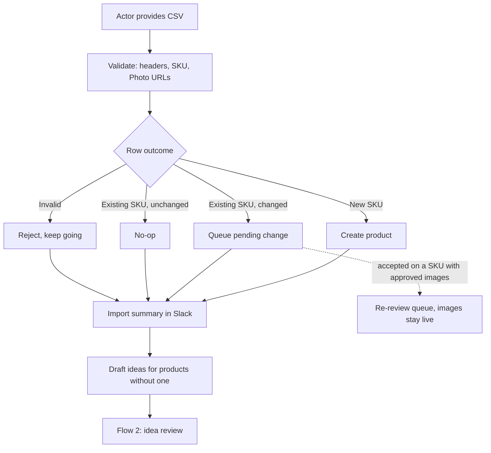

# User Flows

> Companion to [REQUIREMENTS.md](REQUIREMENTS.md) and [ASSUMPTIONS.md](ASSUMPTIONS.md).
> Requirements say *what* the system does and why. This document walks a person
> through it message by message, so gaps show up before the build rather than during it.
>
> Status: **Flow 1 complete — all seven decisions it raised are settled.** Flows 2–8 not started.
> Items marked **[OPEN]** carry options only; nothing is decided until a **Decision** line is filled in.

## Conventions

- **Actor** is the person acting; **System** is what the app does in response.
- Slack messages are shown as mockups, because they *are* the UI: per ASSUMPTIONS #2
  there is no web app to log into and no email approval path.
- `[Button]` is a Slack action button. Everything must work one-handed on a phone.
- Each flow states its **trigger**, **preconditions**, **exit state**, and the flow it hands off to.
- References like (#12) point at the numbered entries in ASSUMPTIONS.md.

## Flow index

| # | Flow | Primary actor | Status |
|---|---|---|---|
| 1 | Import a new CSV export | Ellie or Maya | **Settled** |
| 2 | Idea review (batch) | Ellie | Not started |
| 3 | Generation → candidate review → approval | Ellie | Not started |
| 4 | Status check | Maya | Not started |
| 5 | Photographer upload | Freelancer | Not started |
| 6 | Replace a source photo | Anyone | Not started |
| 7 | Consuming approved images | Web person | Not started |
| 8 | First-run install and setup | Whoever installs | Not started |

---

# Flow 1 — Import a new CSV export

**Goal:** a fresh export from the Google Sheet becomes tracked products with drafted
shot ideas, without overwriting anything the team has already decided.

**Trigger:** someone exports the sheet and wants the new products in the system. The
worked example throughout is the one the brief names: a **40-product Q4 drop**, same
columns as `data/catalog.csv`, mostly new SKUs, `Shot Idea` mostly blank.

**Preconditions**
- The Slack app is installed and a review channel is configured (#2a).
- The house style blurb has been seeded and confirmed (#3b, Flow 8).
- The actor is in the channel. Anyone can import; this is not an Ellie-only action.

**Exit state:** every row with a usable SKU exists as a product, changes to existing products are
either accepted or explicitly kept, rejected rows are reported, the import exists as a
named **drop** for status (#5), and drafted ideas are queued for review.

**Hands off to:** Flow 2 (idea review). No image is generated by this flow (#3).

## Main path



### Step 1 — Get the file into the system

**Actor:** has a `.csv` exported from the sheet, on a laptop or a phone.

**Decision: A — Slack file drop.** The actor drags the CSV into the review channel and
the bot picks up the `.csv` attachment. No command to remember, no page to visit, and the
demo is a single gesture. Alternatives considered and rejected:

| Option | How it feels | Cost |
|---|---|---|
| **A. Slack file drop** — drag the CSV into the review channel (or `#shot-imports`); the bot picks up any `.csv` attachment | Zero new surfaces. Consistent with #2 ("Slack is primary"). Demos in one gesture. | Needs `files:read` scope and a file-download step. Ambiguity if someone drops an unrelated CSV. |
| **B. `/shots import <url>`** — paste a published-sheet CSV link | Works from a phone with no file handling. Re-importing is repeating one command. | The team must publish the sheet; a URL is easy to get wrong. |
| **C. Web upload form** — a link posted in Slack | Familiar; room for a real preview screen. | A page to visit. This is the exact shape of the dashboard Maya's team already abandoned. |

**What the decision commits us to**
- Slack scopes for reading file attachments, and a download step before parsing.
- The bot reacts to `.csv` attachments **only in channels it has been invited to**, so it
  never comments on a spreadsheet someone shares elsewhere.
- A non-CSV or unparseable attachment gets one reply and nothing else (see Branches).
- Re-importing is re-dropping the file, which Step 3's idempotency already makes safe.

**Still worth revisiting later, not now:** `/shots import <url>` as a second entry point.
It is the better phone story, but it needs the sheet published and shares everything from
Step 2 onward — so it is additive, and this flow does not depend on it.

### Step 2 — Acknowledge and validate

**System:** replies immediately in thread so the actor knows it landed, then validates.
Validation is tolerant (#12): headers matched loosely on case and whitespace, `SKU` and
`Photo` required, unknown columns ignored, blank cells never erase.

Checking 40 photo URLs is network work, so this is async and visibly so.

```
📥  Reading catalog-q4-drop.csv — 40 rows, checking photo URLs…
```

A row is **rejected** (and the rest of the file still imports) only when its identity is
unusable: the SKU is missing, or the SKU is duplicated within the file. There is nothing
to key on, so there is nothing to keep.

An **unreachable photo URL is not a rejection** — see Step 5. It is a state the product
carries, not a reason to drop the row.

### Step 3 — Apply what is safe, hold what is not

**System:** applies the two outcomes that cannot destroy anything, and queues the one that can.

| Row | Action | Why |
|---|---|---|
| New SKU | Created immediately | Nothing to overwrite (#12) |
| Existing SKU, detail or photo changed | Held as a **pending change** | A stale export must not revert a fixed price or a replaced photo (#12) |
| Existing SKU, unchanged | No-op | Makes re-importing the same file safe |
| **Archived** SKU present in the file | **Unarchived**, and called out in the summary | Being in a fresh export means the team wants it back (Step 4) |
| Any SKU, photo URL unreachable | Row still applies; the **photo is skipped**, not the product | A broken link is a link problem, not a data problem (Step 5) |
| Missing or duplicate SKU | Rejected and reported | Nothing to key the record on (#12) |

Never touched by an import: approvals, candidates, priority flags, archive state (#12).
Nothing is ever deleted for being absent from a file (#6).

**Implication worth stating:** because unchanged rows are no-ops and SKUs match by key,
**re-dropping the same file is safe and idempotent**. That matters because "fix the two
bad rows in the sheet and export again" is what a person will actually do.

### Step 4 — Import summary

**System:** posts one summary message. This is the only message most imports produce.

```
🗂  Import complete — catalog-q4-drop.csv
     Drop: Q4 Drop ✎ · 40 rows read

     ✅  35 new products created
     ♻️   2 archived products are back           [Undo] · HG-032, HG-036
     ✏️   2 changes to review                    [Review changes]
     ⚠️   1 row dropped · 1 photo unfetchable    [Show details]
     💡  37 products have no approved shot idea

     One question before I draft ideas for those 37 — is this batch for a
     campaign? Drafting starts either way (about $0.02). No image is
     generated until you approve an idea.

     [No theme]   [Set a theme…]   [Holiday / Q4 ↺]
```

Three decisions are settled in that message.

**Decision (1.3 + 1.4, together): the summary asks for a campaign theme, and drafting
starts the moment that question is answered.** These were never two decisions. A campaign
theme is an overlay on drafting (#3b), so it only means anything if it is set *before*
drafting runs — and import is both the moment a person knows the answer and the last
moment it is free to act on. Asking once, inline, gets the Q4 drop themed on the first
pass with no re-draft and no dangling `[Draft ideas]` button to forget.

- `[No theme]` is a real answer, not a dismissal — it starts drafting against the house
  style blurb alone. Routine imports are one tap.
- `[Set a theme…]` opens a plain-text box ("holiday mantel, evergreen, candlelight").
  Plain text, because #3b keeps both style layers as text the team owns.
- Recently used themes appear as one-tap chips (`[Holiday / Q4 ↺]`), so a second Q4 import
  does not retype anything.
- The theme is recorded on every idea it produced, so approved images know which campaign
  made them (#3b) — which is what keeps campaign *sets* available later with no migration.

**The cost, stated plainly:** this puts a required answer between the import and any
drafted ideas. An import nobody answers produces **nothing** — no ideas, no queue, no
visible progress — and it is blocked on a person rather than on work. That is the same
shape as the 1-of-2 approved SKU from #5a: invisible unless something surfaces it. So it
must appear in the stuck-item list in status (#5) and be covered by nudges, which #5a
already promoted from an extra to a dependency. See Branches.

*(Rejected: auto-drafting on import. It is one fewer tap, but it spends the Q4 drop's first
pass on 37 untethered ideas and makes the campaign a re-draft — trading a question for
rework at exactly the moment the brief says the theme matters.)*

**Decision (1.2): the drop name is derived from the file, shown in the summary, and
editable inline.** Maya types this name (`/shots status q4-drop`), so it is user-facing
copy, not an internal id — but it is not worth a second required question on a message
that already has one.

- Derived from the filename, falling back to the date: `catalog-q4-drop.csv` → **"Q4 Drop"**;
  `export(3).csv` → **"Import of Sep 15"**.
- Rendered as editable text (`Drop: Q4 Drop ✎`). Right most of the time if ignored, one tap
  to fix when the filename is junk — which is the case this handles and a plain rename
  action does not, because nobody goes back to rename a drop they never noticed was named badly.
- Renameable later too, from status. The name is a label; the drop's identity is the import.
- Names need not be unique. Two "Q4 Drop" imports are two drops; status disambiguates by date.

*(Rejected: asking for the name alongside the campaign theme. It is the most accurate
option and the wrong trade — it doubles the size of the one prompt that already blocks
every import, to fix a filename that is usually fine.)*

**Decision (1.7): a SKU that shows up in an import is unarchived, and the summary says so.**
Archive is not a graveyard. It is how this team says *not right now* — a product that is
seasonally unavailable, or one they stopped shooting. So a fresh export containing it is
the team bringing it back, usually to shoot it again under a new theme. Treating that as
"stays hidden" would mean the Q4 export quietly omits the products the Q4 campaign is for.

- Unarchived products are **named, not just counted**, and carry a one-tap `[Undo]` that
  re-archives the whole set.
- The notice sits in the **same message as the campaign question**, which is what makes this
  safe: drafting has not started yet (Step 4), so a stale export that resurrects thirty
  products is one tap to undo *before* any of them reach the idea queue or cost anything.
  The required question turns out to double as the review point for everything the import
  did automatically.
- A product comes back with its **history intact** — approved images, ideas, past decisions.
  It is not a new product.

**The #3b blind spot, arriving here.** An unarchived seasonal product may already have 2+
approved images, so it reads as **done** (#5a) even though the whole reason it was
re-imported is that it needs new themed shots. It will not appear in any "needs work"
count — visible in the mockup above, where 2 products come back but the ideas-needed
count goes to 37, not 39. Until done becomes per-request, the themed run itself is the tracking unit (#3b) —
which means these products must be visible *as a named list* in the import summary, not
folded into a number. That is why `[Undo] · HG-032, HG-036` names them.

*(Rejected: leaving them archived with a notice. It respects the original decision, but it
makes the common case — bringing a seasonal product back for a campaign — the one that
needs extra taps, and the stale-export risk is already covered by undoing before drafting.)*

### Step 5 — Skipped rows and missing photos

**Decision (1.5): re-import is the only repair path — but a bad photo URL no longer costs
you the row.** Two halves.

**Repair is re-import.** Fix the sheet, drop the file again. Step 3's idempotency makes
that safe and duplicate-free, it keeps the sheet authoritative through the transition
(#3a), and it adds no UI. Rejected: a per-row fix in Slack — it writes the correction to
the database but not to the sheet, so the next export re-breaks the same row and the team
learns that imports lie.

**But rejection is now reserved for broken identity.** A missing or duplicate SKU is
unusable and is dropped. An unreachable photo URL is not: the row still applies, and the
product carries a **missing source photo** state instead of vanishing into a Slack message
that scrolls away. Two cases, and they behave differently:

| Situation | What happens |
|---|---|
| Photo URL unreachable, **and the SKU has no photo in the database** | Product is created and flagged **needs a source photo**. Ideas still get drafted — they are text and need no photo. The warning appears in idea review. |
| Photo URL unreachable, **but the SKU already has a photo** | Nothing is flagged and nothing is said beyond a line in the summary. The existing source photo version stands. Consistent with "blanks never erase" (#12) — a broken link must not erase a working photo. |

```
⚠️  1 of 40 rows dropped, 1 photo couldn't be fetched. The rest imported fine.

     Row 27   (blank)  missing SKU — fix in the sheet and import again
     Row 14   HG-047   photo URL returned 404 — product imported without a photo
```

**Why this matters more than it looks.** The flow's job is to make sure work is never
silently lost, and a rejected row is exactly that: invisible the moment the message scrolls.
A flagged product sits in the queue, in status, and in nudges — the same machinery #5a already
requires. The fix is also already built: **replace source photo** (#11), one upload in Slack,
which means a phone-only person can unblock the product without a per-row import UI.

> **Refines ASSUMPTIONS #12**, which lists an unreachable photo URL among the rejection
> criteria. Flagged for the interpretation check in REQUIREMENTS § A.

### Step 6 — Review changes to existing products

Usually empty for a fresh drop of new SKUs, but this is the step that prevents the
brief's "wrong image live for three weeks" from happening a second way.

**Actor:** taps `[Review changes]`. **System:** one card per changed SKU.

Individually, a card looks like this:

```
✏️  HG-018 — Ceramic Planter Set (3 sizes)
     Price    $64  →  $72
     Photo    [ current ]  →  [ incoming ]
     Notes    —    →  "El: new photo, old one was cropped weird"

     ⚠️ This product has 3 approved images. Accepting the photo change
        sends them to re-review — they stay live until you decide.

     [Accept]   [Keep current]   [Later]
```

Accepting a photo change creates a new **source photo version**; the original is kept and
every candidate records which version it came from (#11). Accepting a change on a SKU that
already has approved images puts those images in a short re-review — **keep** or **replace** —
and they stay live meanwhile, so the site never loses images mid-decision (#12).

A **new or changed Shot Idea** is not a change to review. It skips this step entirely and
goes straight into idea review (#12), because an idea is a proposal, not a fact about the product.

**Decision (1.6): accept-all for detail changes; photo changes are always individual.**
Three cards one at a time is fine. Thirty is not — and a long list is what makes people
tap through without reading, which costs the review its entire purpose.

The split is by **blast radius**, not by importance:

| Change | Bulk-acceptable | Why |
|---|---|---|
| Price, name, category, color, material, notes | **Yes** | Wrong is wrong, but it is text in a database. Nothing goes live and no image becomes a lie. |
| Photo URL | **No, one at a time** | A new photo creates a new source version (#11) and can send approved images to re-review (#12). This is the exact path to "the wrong image was live for three weeks." |

```
✏️  2 changes from catalog-q4-drop.csv

     HG-018   Price $64 → $72 · Notes added
     HG-021   Category "Textiles" → "Home Textiles"

     [Accept both]   [Review one by one]

     1 photo change needs your eyes individually.        [Review photo change]
```

Detail and photo changes are **counted and presented separately**, so a bulk accept can
never quietly include a photo. The mixed case — one SKU changing both price and photo —
splits: the detail half can be bulk-accepted, the photo half still gets its own card.

Every accept is attributed, bulk or not, so the audit trail can answer "who let that
price through" (#1, and the audit-trail item in REQUIREMENTS Part 3).

*(Rejected: splitting by whether the SKU has approved images. It groups by true
consequence, but which card is bulk-able then depends on invisible product state — the
person cannot tell by looking, which is a bad property for a bulk action.)*

### Step 7 — Idea drafting runs

**System:** as soon as the campaign question in Step 4 is answered, drafts options for every
product without an approved idea, using product data, notes (#7), the house style blurb,
and the campaign theme if one was set (#3b). Two modes (#9):

- **Expand** — the product arrived with a `Shot Idea`. Option 1 is a faithful rewrite of it
  in the standard detailed format with any question resolved into a concrete choice;
  options 2–3 are variations. The raw original is kept and shown for context.
- **Draft** — the product has no idea. Three options from product data.

Both modes produce the same structured format, so the review screen is uniform whether a
human wrote the seed or not.

```
💡  Drafting ideas for 37 products… I'll post them for review in a few minutes.
```

### Step 8 — Hand off to idea review

**System:** posts the drafted ideas for review and the import flow is done.

```
💡  37 products have ideas ready for review — Q4 Drop.
     ⚠️  1 of them (HG-047) needs a source photo before it can generate.
     Nothing is generated until you approve.               [Start reviewing]
```

A product flagged **needs a source photo** (Step 5) carries that warning into idea review:
its idea can be approved normally, but approval will not start a generation until a photo
is uploaded (#11). The warning travels with the product rather than living in the import
message, which is the point of not rejecting the row.

**Exit state reached.** Products exist, changes are resolved, the drop exists for status,
and the queue is text-only — no money has been spent beyond a cent of drafting (#3, #13).

## Branches and failure cases

| What happens | System response |
|---|---|
| File is not a CSV, or is empty | One reply in thread naming the problem; nothing imported. |
| Headers unrecognizable (`SKU` or `Photo` missing) | Whole file rejected with the headers it did find. This is the only whole-file rejection. |
| Every row rejected | Summary still posts, so the failure is visible rather than silent. |
| Same file imported twice | Second import reports "0 new · 0 changes" (Step 3 idempotency). |
| Two people import at once | Second import queues behind the first; SKU matching makes the result the same either way. |
| Photo URL host is down at import time | Every affected product still imports, flagged **needs a source photo** (Step 5). Recovery is a re-import once the host is back, or a photo upload per product (#11). A flaky host no longer turns a clean import into a partial one — it turns it into a visible to-do list. |
| A row's SKU was previously **archived** (#6) | Unarchived, named in the summary, one tap to undo before drafting starts (Step 4). History comes back with it. |
| **Campaign question never answered** | No ideas are drafted; the drop sits at zero progress, blocked on a person. Surfaces in the stuck-item list (#5) and via nudges. Consequence of the Step 4 decision — see there. |
| CSV dropped in a channel the bot isn't in | Nothing happens, by design (Step 1). The bot reacts to `.csv` attachments only where it was invited, or it comments on every spreadsheet the team shares. |

## Open decisions raised by this flow

| ID | Decision | Blocks |
|---|---|---|
| ~~1.1~~ | ~~CSV entry point~~ — **settled: Slack file drop** | — |
| ~~1.2~~ | ~~Drop name~~ — **settled: derived from filename, editable inline** | — |
| ~~1.3~~ | ~~Campaign theme at import~~ — **settled: asked inline in the summary** | — |
| ~~1.4~~ | ~~Drafting automatic or one tap~~ — **settled: starts when 1.3 is answered** | — |
| ~~1.5~~ | ~~Repair path for skipped rows~~ — **settled: re-import only; bad photo flags the product instead of dropping the row** | — |
| ~~1.6~~ | ~~Accept-all for pending changes~~ — **settled: bulk for details, individual for photos** | — |
| ~~1.7~~ | ~~Archived SKU in an import~~ — **settled: unarchived and named, undoable before drafting** | — |

## Requirements this flow exercises

ASSUMPTIONS #2, #2a (Slack as the only surface) · #3, #3a (database of record; ideas before
images) · #3b (house style and campaign theme) · #5 (drop grouping for status) · #6 (archive,
never delete) · #7 (notes as context) · #9 (expand vs. draft) · #11 (source photo versions) ·
#12 (the whole merge contract) · #13 (drafting cost).
